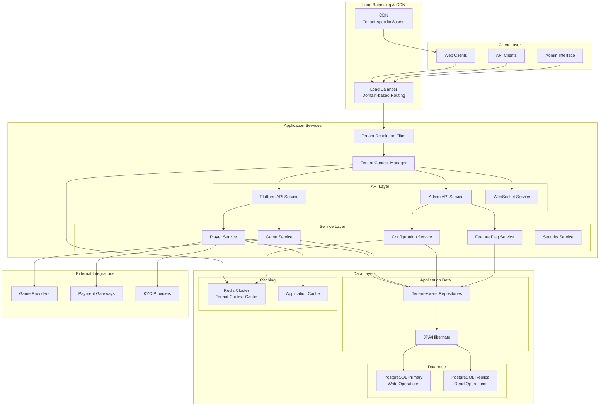

# UG Casino Multitenancy - Technical Architecture

**Document Version:** 1.0  
**Date:** July 2025  
**Status:** Complete  
**Author:** Technical Architecture Team  

## Architecture Overview

This document defines the comprehensive technical architecture for implementing multitenancy in the UG Casino platform using a domain-based tenant isolation approach.

### Architecture Principles

1. **Tenant Isolation** - Complete logical separation of tenant data and operations
2. **Shared Infrastructure** - Cost-effective resource utilization across tenants
3. **Security First** - Multi-layered security with zero cross-tenant data access
4. **Performance** - Minimal latency overhead for tenant operations
5. **Scalability** - Support for 100+ concurrent casino brands
6. **Operational Simplicity** - Easy tenant provisioning and management

### High-Level Architecture



## Core Components

### 1. Tenant Context Management

#### Tenant Context Provider
```java
@Component
public class TenantContext {
    private static final ThreadLocal<TenantInfo> TENANT_CONTEXT = new ThreadLocal<>();
    
    public static void setTenant(TenantInfo tenantInfo) {
        TENANT_CONTEXT.set(tenantInfo);
    }
    
    public static TenantInfo getCurrentTenant() {
        TenantInfo tenant = TENANT_CONTEXT.get();
        if (tenant == null) {
            throw new TenantContextException("No tenant context found");
        }
        return tenant;
    }
    
    public static Optional<TenantInfo> getCurrentTenantOptional() {
        return Optional.ofNullable(TENANT_CONTEXT.get());
    }
    
    public static void clear() {
        TENANT_CONTEXT.remove();
    }
}

@Data
@Builder
public class TenantInfo {
    private Long domainId;
    private String tenantCode;
    private String displayName;
    private String url;
    private TenantStatus status;
    private Map<String, String> configuration;
    private Set<String> allowedDomains;
    private ZoneId timeZone;
    private String defaultCurrency;
}
```

#### Tenant Resolution Filter
```java
@Component
@Order(1)
public class TenantResolutionFilter implements Filter {
    
    private final TenantCacheService tenantCacheService;
    private final DomainService domainService;
    
    @Override
    public void doFilter(ServletRequest request, ServletResponse response, 
                        FilterChain chain) throws IOException, ServletException {
        
        HttpServletRequest httpRequest = (HttpServletRequest) request;
        HttpServletResponse httpResponse = (HttpServletResponse) response;
        
        try {
            TenantInfo tenantInfo = resolveTenant(httpRequest);
            
            if (tenantInfo == null) {
                handleUnknownTenant(httpResponse);
                return;
            }
            
            if (tenantInfo.getStatus() != TenantStatus.ACTIVE) {
                handleInactiveTenant(httpResponse, tenantInfo);
                return;
            }
            
            TenantContext.setTenant(tenantInfo);
            
            // Add tenant headers for debugging and monitoring
            httpResponse.setHeader("X-Tenant-Code", tenantInfo.getTenantCode());
            httpResponse.setHeader("X-Tenant-Status", tenantInfo.getStatus().name());
            
            chain.doFilter(request, response);
            
        } finally {
            TenantContext.clear();
        }
    }
    
    private TenantInfo resolveTenant(HttpServletRequest request) {
        // 1. Try explicit tenant header (for API clients)
        String tenantHeader = request.getHeader("X-Tenant-Code");
        if (tenantHeader != null) {
            return tenantCacheService.getTenantByCode(tenantHeader);
        }
        
        // 2. Resolve by domain/host
        String host = extractHost(request);
        return tenantCacheService.getTenantByDomain(host);
    }
    
    private String extractHost(HttpServletRequest request) {
        String host = request.getHeader("Host");
        if (host == null) {
            host = request.getServerName();
        }
        
        // Handle port numbers and protocols
        if (host.contains(":")) {
            host = host.substring(0, host.indexOf(":"));
        }
        
        return host.toLowerCase();
    }
}
```

### 2. Enhanced Data Model

#### Enhanced Domain Entity
```java
@Entity
@Table(name = "domain")
@EntityListeners(AuditingEntityListener.class)
public class Domain {
    @Id
    @GeneratedValue(strategy = GenerationType.IDENTITY)
    private Long id;
    
    @Column(name = "url", nullable = false, unique = true, length = 256)
    private String url;
    
    @Column(name = "tenant_code", nullable = false, unique = true, length = 64)
    private String tenantCode; // e.g., "fairspin", "trueplay", "whitelabel1"
    
    @Column(name = "display_name", nullable = false, length = 128)
    private String displayName; // e.g., "FairSpin Casino", "TruePlay"
    
    @Column(name = "status", nullable = false)
    @Enumerated(EnumType.STRING)
    private TenantStatus status; // ACTIVE, INACTIVE, MAINTENANCE, SUSPENDED
    
    @CreatedDate
    @Column(name = "created_at", nullable = false)
    private LocalDateTime createdAt;
    
    @LastModifiedDate
    @Column(name = "updated_at")
    private LocalDateTime updatedAt;
    
    @Column(name = "configuration_json", columnDefinition = "jsonb")
    private String configurationJson; // Tenant-specific config overrides
    
    @Column(name = "parent_domain_id")
    private Long parentDomainId; // For brand hierarchies
    
    // Tenant branding and customization
    @Column(name = "theme_config", columnDefinition = "jsonb")
    private String themeConfig;
    
    @Column(name = "logo_url", length = 512)
    private String logoUrl;
    
    @Column(name = "primary_color", length = 7)
    private String primaryColor; // #HEX color
    
    @Column(name = "secondary_color", length = 7)
    private String secondaryColor;
    
    @Column(name = "favicon_url", length = 512)
    private String faviconUrl;
    
    @Column(name = "default_language", length = 5)
    private String defaultLanguage; // e.g., "en_US"
    
    @Column(name = "default_currency", length = 3)
    private String defaultCurrency; // e.g., "USD"
    
    @Column(name = "timezone", length = 50)
    private String timezone; // e.g., "America/New_York"
    
    // SEO and metadata
    @Column(name = "meta_title", length = 255)
    private String metaTitle;
    
    @Column(name = "meta_description", length = 500)
    private String metaDescription;
    
    @Column(name = "meta_keywords", length = 1000)
    private String metaKeywords;
    
    // Operational settings
    @Column(name = "max_players")
    private Integer maxPlayers; // Tenant capacity limit
    
    @Column(name = "maintenance_message", length = 1000)
    private String maintenanceMessage;
    
    @Column(name = "support_email", length = 255)
    private String supportEmail;
    
    @Column(name = "support_phone", length = 50)
    private String supportPhone;
    
    // Validation and utility methods
    public String getUrlWithoutScheme() {
        if (url == null) return null;
        return url.replaceFirst("^https?://", "").replaceFirst("/$", "");
    }
    
    public boolean isActive() {
        return TenantStatus.ACTIVE.equals(status);
    }
    
    public Map<String, Object> getConfigurationMap() {
        if (configurationJson == null) return new HashMap<>();
        try {
            return objectMapper.readValue(configurationJson, Map.class);
        } catch (Exception e) {
            log.warn("Failed to parse configuration JSON for tenant {}", tenantCode, e);
            return new HashMap<>();
        }
    }
}

public enum TenantStatus {
    ACTIVE,         // Fully operational
    INACTIVE,       // Temporarily disabled
    MAINTENANCE,    // Under maintenance
    SUSPENDED,      // Administratively suspended
    ARCHIVED        // Permanently disabled, data retained
}
```

#### Tenant-Aware Core Entities
```java
// Enhanced Player Entity
@Entity
@Table(name = "player")
public class Player implements TenantAware {
    @Id
    @GeneratedValue(strategy = GenerationType.IDENTITY) 
    private Integer id;
    
    @Column(name = "domain_id", nullable = false)
    private Long domainId; // Tenant isolation key
    
    @ManyToOne(fetch = FetchType.LAZY)
    @JoinColumn(name = "domain_id", insertable = false, updatable = false)
    private Domain domain;
    
    @Column(name = "login", nullable = false, length = 128)
    private String login;
    
    @Column(name = "email", length = 255)
    private String email;
    
    // Existing player fields...
    private String passwordHash;
    private PlayerStatus status;
    private LocalDateTime createdAt;
    private String mirrorUrl; // Legacy field, can be deprecated
    
    // Tenant context validation
    @PrePersist
    @PreUpdate
    private void validateTenantContext() {
        if (domainId == null) {
            TenantInfo currentTenant = TenantContext.getCurrentTenantOptional()
                .orElseThrow(() -> new IllegalStateException("Player must be created within tenant context"));
            this.domainId = currentTenant.getDomainId();
        }
    }
    
    // Unique constraints within tenant
    @Table(uniqueConstraints = {
        @UniqueConstraint(columnNames = {"domain_id", "login"}),
        @UniqueConstraint(columnNames = {"domain_id", "email"})
    })
}

// Enhanced Game Session Entity
@Entity
@Table(name = "external_game_session")
public class ExternalGameSession implements TenantAware {
    @Id
    @GeneratedValue(strategy = GenerationType.IDENTITY)
    private Long id;
    
    @Column(name = "domain_id", nullable = false)
    private Long domainId;
    
    @Column(name = "player_id", nullable = false)
    private Integer playerId;
    
    @Column(name = "provider_id", nullable = false)
    private Integer providerId;
    
    @Column(name = "game_id", nullable = false)
    private Integer gameId;
    
    // Existing game session fields...
    private String sessionToken;
    private GameSessionStatus status;
    private LocalDateTime startedAt;
    private LocalDateTime endedAt;
    
    // Ensure player belongs to same tenant
    @PrePersist
    @PreUpdate
    private void validateTenantConsistency() {
        TenantInfo currentTenant = TenantContext.getCurrentTenant();
        if (!currentTenant.getDomainId().equals(this.domainId)) {
            throw new TenantConsistencyException("Game session tenant mismatch");
        }
    }
}

// Marker interface for tenant-aware entities
public interface TenantAware {
    Long getDomainId();
    void setDomainId(Long domainId);
}
```

### 3. Data Access Layer

#### Tenant-Aware Repository Pattern
```java
// Base Tenant-Aware Repository Interface
@NoRepositoryBean
public interface TenantAwareRepository<T extends TenantAware, ID> extends JpaRepository<T, ID> {
    
    @Query("SELECT e FROM #{#entityName} e WHERE e.domainId = :#{T(platform.commons.TenantContext).getCurrentTenant().domainId}")
    List<T> findAllForCurrentTenant();
    
    @Query("SELECT e FROM #{#entityName} e WHERE e.domainId = :domainId")
    List<T> findAllForTenant(@Param("domainId") Long domainId);
    
    @Query("SELECT e FROM #{#entityName} e WHERE e.id = :id AND e.domainId = :#{T(platform.commons.TenantContext).getCurrentTenant().domainId}")
    Optional<T> findByIdForCurrentTenant(@Param("id") ID id);
    
    @Query("SELECT COUNT(e) FROM #{#entityName} e WHERE e.domainId = :#{T(platform.commons.TenantContext).getCurrentTenant().domainId}")
    long countForCurrentTenant();
    
    @Modifying
    @Query("DELETE FROM #{#entityName} e WHERE e.id = :id AND e.domainId = :#{T(platform.commons.TenantContext).getCurrentTenant().domainId}")
    int deleteByIdForCurrentTenant(@Param("id") ID id);
}

// Enhanced Player Repository
@Repository
public interface PlayerRepository extends TenantAwareRepository<Player, Integer> {
    
    // Tenant-aware queries
    @Query("SELECT p FROM Player p WHERE p.login = :login AND p.domainId = :#{T(platform.commons.TenantContext).getCurrentTenant().domainId}")
    Optional<Player> findByLoginForCurrentTenant(@Param("login") String login);
    
    @Query("SELECT p FROM Player p WHERE p.email = :email AND p.domainId = :#{T(platform.commons.TenantContext).getCurrentTenant().domainId}")
    Optional<Player> findByEmailForCurrentTenant(@Param("email") String email);
    
    @Query("SELECT p FROM Player p WHERE p.status = :status AND p.domainId = :#{T(platform.commons.TenantContext).getCurrentTenant().domainId}")
    List<Player> findByStatusForCurrentTenant(@Param("status") PlayerStatus status);
    
    // Cross-tenant queries (for admin operations)
    @Query("SELECT p FROM Player p WHERE p.login = :login AND p.domainId = :domainId")
    Optional<Player> findByLoginAndDomain(@Param("login") String login, @Param("domainId") Long domainId);
    
    @Query("SELECT p FROM Player p WHERE p.email = :email AND p.domainId = :domainId")
    Optional<Player> findByEmailAndDomain(@Param("email") String email, @Param("domainId") Long domainId);
    
    // Bulk operations with tenant safety
    @Modifying
    @Query("UPDATE Player p SET p.status = :status WHERE p.id IN :ids AND p.domainId = :#{T(platform.commons.TenantContext).getCurrentTenant().domainId}")
    int updateStatusForCurrentTenant(@Param("ids") List<Integer> ids, @Param("status") PlayerStatus status);
    
    // Analytics queries
    @Query("SELECT COUNT(p) FROM Player p WHERE p.createdAt >= :since AND p.domainId = :#{T(platform.commons.TenantContext).getCurrentTenant().domainId}")
    long countNewPlayersForCurrentTenant(@Param("since") LocalDateTime since);
    
    @Query("SELECT p.status, COUNT(p) FROM Player p WHERE p.domainId = :#{T(platform.commons.TenantContext).getCurrentTenant().domainId} GROUP BY p.status")
    List<Object[]> getPlayerStatusDistributionForCurrentTenant();
}
```

### 4. Service Layer Architecture

#### Tenant-Aware Service Pattern
```java
// Service-level tenant security
@Aspect
@Component
public class TenantSecurityAspect {
    
    @Around("@annotation(TenantSecured)")
    public Object validateTenantAccess(ProceedingJoinPoint joinPoint) throws Throwable {
        TenantInfo tenant = TenantContext.getCurrentTenant();
        
        // Validate tenant is active
        if (tenant.getStatus() != TenantStatus.ACTIVE) {
            throw new TenantAccessException("Tenant is not active: " + tenant.getTenantCode());
        }
        
        // Validate method parameters for tenant context
        Object[] args = joinPoint.getArgs();
        validateArgumentTenantContext(args, tenant);
        
        // Add tenant context to MDC for logging
        MDC.put("tenantCode", tenant.getTenantCode());
        MDC.put("domainId", tenant.getDomainId().toString());
        
        try {
            return joinPoint.proceed();
        } finally {
            MDC.remove("tenantCode");
            MDC.remove("domainId");
        }
    }
    
    private void validateArgumentTenantContext(Object[] args, TenantInfo tenant) {
        for (Object arg : args) {
            if (arg instanceof TenantAware) {
                TenantAware tenantAware = (TenantAware) arg;
                if (tenantAware.getDomainId() != null && 
                    !tenant.getDomainId().equals(tenantAware.getDomainId())) {
                    throw new TenantAccessException("Cross-tenant data access attempt detected");
                }
            }
        }
    }
}

// Enhanced Player Service
@Service
@TenantSecured
@Transactional
public class PlayerServiceImpl implements PlayerService {
    
    private final PlayerRepository playerRepository;
    private final TenantAuditService auditService;
    private final PlayerValidator playerValidator;
    private final EmailService emailService;
    
    @Override
    @PreAuthorize("hasApiPermission('player', 'read')")
    public Optional<PlayerDto> getPlayerById(Integer playerId) {
        TenantInfo tenant = TenantContext.getCurrentTenant();
        
        Optional<Player> player = playerRepository.findByIdForCurrentTenant(playerId);
        
        if (player.isPresent()) {
            auditService.logDataAccess("player.read", playerId, tenant.getDomainId());
        }
        
        return player.map(this::mapToDto);
    }
    
    @Override
    @PreAuthorize("hasApiPermission('player', 'create')")
    public PlayerDto createPlayer(CreatePlayerRequest request) {
        TenantInfo tenant = TenantContext.getCurrentTenant();
        
        // Validate email uniqueness within tenant
        if (playerRepository.findByEmailForCurrentTenant(request.getEmail()).isPresent()) {
            throw new PlayerEmailExistsException("Email already registered in this casino");
        }
        
        // Validate login uniqueness within tenant
        if (playerRepository.findByLoginForCurrentTenant(request.getLogin()).isPresent()) {
            throw new PlayerLoginExistsException("Login already exists in this casino");
        }
        
        // Validate request data
        playerValidator.validateCreateRequest(request, tenant);
        
        Player player = new Player();
        player.setDomainId(tenant.getDomainId());
        player.setEmail(request.getEmail());
        player.setLogin(request.getLogin());
        player.setPasswordHash(passwordEncoder.encode(request.getPassword()));
        player.setStatus(PlayerStatus.ACTIVE);
        player.setCreatedAt(LocalDateTime.now());
        
        Player savedPlayer = playerRepository.save(player);
        
        // Send welcome email with tenant branding
        emailService.sendWelcomeEmail(savedPlayer, tenant);
        
        auditService.logPlayerCreation(savedPlayer.getId(), tenant.getDomainId());
        
        return mapToDto(savedPlayer);
    }
    
    @Override
    @PreAuthorize("hasApiPermission('player', 'update')")
    public PlayerDto updatePlayer(Integer playerId, UpdatePlayerRequest request) {
        Player player = playerRepository.findByIdForCurrentTenant(playerId)
            .orElseThrow(() -> new PlayerNotFoundException("Player not found in current tenant"));
        
        TenantInfo tenant = TenantContext.getCurrentTenant();
        
        // Validate updates
        playerValidator.validateUpdateRequest(request, player, tenant);
        
        // Apply updates
        if (request.getEmail() != null && !request.getEmail().equals(player.getEmail())) {
            // Check email uniqueness within tenant
            if (playerRepository.findByEmailForCurrentTenant(request.getEmail()).isPresent()) {
                throw new PlayerEmailExistsException("Email already registered in this casino");
            }
            player.setEmail(request.getEmail());
        }
        
        if (request.getStatus() != null) {
            player.setStatus(request.getStatus());
        }
        
        Player updatedPlayer = playerRepository.save(player);
        
        auditService.logPlayerUpdate(playerId, tenant.getDomainId(), request);
        
        return mapToDto(updatedPlayer);
    }
    
    @Override
    @PreAuthorize("hasApiPermission('player', 'read')")
    public List<PlayerDto> searchPlayers(PlayerSearchRequest request) {
        TenantInfo tenant = TenantContext.getCurrentTenant();
        
        // Build tenant-aware search criteria
        Specification<Player> spec = Specification
            .where(PlayerSpecifications.belongsToTenant(tenant.getDomainId()))
            .and(PlayerSpecifications.matchesSearchCriteria(request));
        
        List<Player> players = playerRepository.findAll(spec, request.getPageable());
        
        auditService.logPlayerSearch(tenant.getDomainId(), request);
        
        return players.stream()
            .map(this::mapToDto)
            .collect(Collectors.toList());
    }
    
    private PlayerDto mapToDto(Player player) {
        return PlayerDto.builder()
            .id(player.getId())
            .login(player.getLogin())
            .email(player.getEmail())
            .status(player.getStatus())
            .createdAt(player.getCreatedAt())
            .tenantCode(TenantContext.getCurrentTenant().getTenantCode())
            .build();
    }
}
```

### 5. Configuration Management Architecture

#### Multi-Tenant Properties Manager
```java
@Service
public class MultiTenantPropertiesManager implements PropertiesManager {
    
    private final TenantPropertyRepository tenantPropertyRepository;
    private final GlobalPropertyRepository globalPropertyRepository;
    private final RedisTemplate<String, Object> redisTemplate;
    private final ObjectMapper objectMapper;
    
    private static final String TENANT_PROPERTY_CACHE_KEY = "tenant:props:%d:%s";
    private static final Duration CACHE_TTL = Duration.ofMinutes(15);
    
    @Override
    public String getStringProperty(PropertyName propertyName) {
        return getStringProperty(propertyName, TenantContext.getCurrentTenant().getDomainId());
    }
    
    public String getStringProperty(PropertyName propertyName, Long tenantId) {
        String cacheKey = String.format(TENANT_PROPERTY_CACHE_KEY, tenantId, propertyName.name());
        
        // Try cache first
        String cachedValue = (String) redisTemplate.opsForValue().get(cacheKey);
        if (cachedValue != null) {
            return CACHE_NULL_VALUE.equals(cachedValue) ? null : cachedValue;
        }
        
        // Check tenant-specific property
        Optional<String> tenantValue = tenantPropertyRepository
            .findByDomainIdAndPropertyName(tenantId, propertyName.name())
            .map(TenantProperty::getPropertyValue);
        
        if (tenantValue.isPresent()) {
            cacheProperty(cacheKey, tenantValue.get());
            return tenantValue.get();
        }
        
        // Fallback to global property
        String globalValue = globalPropertyRepository
            .findByName(propertyName.name())
            .map(Property::getValue)
            .orElse(propertyName.getDefaultValue());
        
        cacheProperty(cacheKey, globalValue);
        return globalValue;
    }
    
    @Override
    public Integer getIntProperty(PropertyName propertyName) {
        String value = getStringProperty(propertyName);
        try {
            return value != null ? Integer.parseInt(value) : null;
        } catch (NumberFormatException e) {
            log.warn("Invalid integer property value for {}: {}", propertyName, value);
            return null;
        }
    }
    
    @Override
    public Boolean getBooleanProperty(PropertyName propertyName) {
        String value = getStringProperty(propertyName);
        return value != null ? Boolean.parseBoolean(value) : null;
    }
    
    @Override
    public <T> T getJsonProperty(PropertyName propertyName, Class<T> clazz) {
        String value = getStringProperty(propertyName);
        if (value == null) return null;
        
        try {
            return objectMapper.readValue(value, clazz);
        } catch (Exception e) {
            log.warn("Failed to parse JSON property {}: {}", propertyName, value, e);
            return null;
        }
    }
    
    public void setTenantProperty(Long tenantId, PropertyName propertyName, String value) {
        TenantProperty property = tenantPropertyRepository
            .findByDomainIdAndPropertyName(tenantId, propertyName.name())
            .orElse(new TenantProperty());
        
        property.setDomainId(tenantId);
        property.setPropertyName(propertyName.name());
        property.setPropertyValue(value);
        property.setUpdatedAt(LocalDateTime.now());
        
        tenantPropertyRepository.save(property);
        
        // Invalidate cache
        String cacheKey = String.format(TENANT_PROPERTY_CACHE_KEY, tenantId, propertyName.name());
        redisTemplate.delete(cacheKey);
        
        // Audit the change
        auditService.logPropertyChange(tenantId, propertyName.name(), value);
    }
    
    public void removeTenantProperty(Long tenantId, PropertyName propertyName) {
        tenantPropertyRepository.deleteByDomainIdAndPropertyName(tenantId, propertyName.name());
        
        // Invalidate cache
        String cacheKey = String.format(TENANT_PROPERTY_CACHE_KEY, tenantId, propertyName.name());
        redisTemplate.delete(cacheKey);
        
        auditService.logPropertyRemoval(tenantId, propertyName.name());
    }
    
    public Map<String, String> getAllTenantProperties(Long tenantId) {
        List<TenantProperty> properties = tenantPropertyRepository.findByDomainId(tenantId);
        
        return properties.stream()
            .collect(Collectors.toMap(
                TenantProperty::getPropertyName,
                TenantProperty::getPropertyValue
            ));
    }
    
    private void cacheProperty(String cacheKey, String value) {
        String cacheValue = value != null ? value : CACHE_NULL_VALUE;
        redisTemplate.opsForValue().set(cacheKey, cacheValue, CACHE_TTL);
    }
    
    private static final String CACHE_NULL_VALUE = "__NULL__";
}

// Tenant Property Entity
@Entity
@Table(name = "tenant_property")
public class TenantProperty {
    @Id
    @GeneratedValue(strategy = GenerationType.IDENTITY)
    private Long id;
    
    @Column(name = "domain_id", nullable = false)
    private Long domainId;
    
    @Column(name = "property_name", nullable = false, length = 128)
    private String propertyName;
    
    @Column(name = "property_value", columnDefinition = "TEXT")
    private String propertyValue;
    
    @Column(name = "created_at", nullable = false)
    private LocalDateTime createdAt = LocalDateTime.now();
    
    @Column(name = "updated_at")
    private LocalDateTime updatedAt = LocalDateTime.now();
    
    @Column(name = "updated_by", length = 128)
    private String updatedBy;
    
    @Column(name = "description", length = 500)
    private String description;
    
    // Unique constraint
    @Table(uniqueConstraints = {
        @UniqueConstraint(columnNames = {"domain_id", "property_name"})
    })
}
```

### 6. Security Architecture

#### Enhanced Security Configuration
```java
@Configuration
@EnableWebSecurity
@EnableGlobalMethodSecurity(prePostEnabled = true)
public class MultiTenantSecurityConfig extends WebSecurityConfigurerAdapter {
    
    private final TenantResolutionFilter tenantResolutionFilter;
    private final TenantSecurityProperties securityProperties;
    
    @Override
    protected void configure(HttpSecurity http) throws Exception {
        http
            // Add tenant resolution before authentication
            .addFilterBefore(tenantResolutionFilter, UsernamePasswordAuthenticationFilter.class)
            
            // Session management with tenant context
            .sessionManagement()
                .sessionCreationPolicy(SessionCreationPolicy.IF_REQUIRED)
                .maximumSessions(1)
                .sessionRegistry(sessionRegistry())
                .and()
            
            // Authorization rules with tenant awareness
            .authorizeRequests()
                .antMatchers("/api/*/tenant/health").permitAll()
                .antMatchers("/api/*/tenant/status").permitAll()
                .antMatchers("/api/admin/**").hasRole("ADMIN")
                .antMatchers("/api/player/**").hasRole("PLAYER")
                .anyRequest().authenticated()
                .and()
            
            // OAuth2 login with tenant-specific configurations
            .oauth2Login()
                .loginPage("/login")
                .successHandler(new TenantAwareAuthenticationSuccessHandler())
                .failureHandler(new TenantAwareAuthenticationFailureHandler())
                .and()
            
            // Form login with tenant context
            .formLogin()
                .loginPage("/login")
                .successHandler(new TenantAwareAuthenticationSuccessHandler())
                .failureHandler(new TenantAwareAuthenticationFailureHandler())
                .and()
            
            // CORS configuration per tenant
            .cors()
                .configurationSource(tenantAwareCorsConfigurationSource())
                .and()
            
            // CSRF with tenant context
            .csrf()
                .csrfTokenRepository(CookieCsrfTokenRepository.withHttpOnlyFalse())
                .ignoringAntMatchers(securityProperties.getCsrfIgnoredPaths())
                .and()
            
            // Exception handling
            .exceptionHandling()
                .authenticationEntryPoint(new TenantAwareAuthenticationEntryPoint())
                .accessDeniedHandler(new TenantAwareAccessDeniedHandler());
    }
    
    @Bean
    public MethodSecurityExpressionHandler methodSecurityExpressionHandler() {
        DefaultMethodSecurityExpressionHandler handler = new DefaultMethodSecurityExpressionHandler();
        handler.setPermissionEvaluator(new TenantPermissionEvaluator());
        return handler;
    }
    
    @Bean
    public CorsConfigurationSource tenantAwareCorsConfigurationSource() {
        return new TenantAwareCorsConfigurationSource();
    }
    
    @Bean
    public SessionRegistry sessionRegistry() {
        return new SessionRegistryImpl();
    }
}

// Tenant Permission Evaluator
@Component
public class TenantPermissionEvaluator implements PermissionEvaluator {
    
    private final AdminUserService adminUserService;
    
    @Override
    public boolean hasPermission(Authentication authentication, Object targetDomainObject, 
                               Object permission) {
        
        if (!(authentication.getPrincipal() instanceof TenantAwareUserDetails)) {
            return false;
        }
        
        TenantAwareUserDetails userDetails = (TenantAwareUserDetails) authentication.getPrincipal();
        TenantInfo currentTenant = TenantContext.getCurrentTenant();
        
        // Super admin has access to everything
        if (userDetails.isSuperAdmin()) {
            return true;
        }
        
        // Check if user has access to current tenant
        if (!userDetails.getAllowedDomainIds().contains(currentTenant.getDomainId())) {
            return false;
        }
        
        // Check specific permission for the tenant
        return userDetails.hasPermissionForDomain(currentTenant.getDomainId(), permission.toString());
    }
    
    @Override
    public boolean hasPermission(Authentication authentication, Serializable targetId, 
                               String targetType, Object permission) {
        return false; // Not implemented for this use case
    }
}
```

### 7. Caching Strategy

#### Tenant-Aware Caching
```java
@Configuration
@EnableCaching
public class TenantCacheConfiguration {
    
    @Bean
    @Primary
    public CacheManager tenantAwareCacheManager(RedisConnectionFactory connectionFactory) {
        RedisCacheManager.Builder builder = RedisCacheManager
            .RedisCacheManagerBuilder
            .fromConnectionFactory(connectionFactory)
            .cacheDefaults(cacheConfiguration());
        
        // Define cache configurations for different types
        Map<String, RedisCacheConfiguration> cacheConfigurations = new HashMap<>();
        
        // Tenant context cache - 30 minutes
        cacheConfigurations.put("tenants", 
            cacheConfiguration().entryTtl(Duration.ofMinutes(30)));
        
        // Tenant properties cache - 15 minutes
        cacheConfigurations.put("tenant-properties", 
            cacheConfiguration().entryTtl(Duration.ofMinutes(15)));
        
        // Feature flags cache - 5 minutes for dynamic updates
        cacheConfigurations.put("feature-flags", 
            cacheConfiguration().entryTtl(Duration.ofMinutes(5)));
        
        // Player data cache - 10 minutes
        cacheConfigurations.put("players", 
            cacheConfiguration().entryTtl(Duration.ofMinutes(10)));
        
        return builder
            .withInitialCacheConfigurations(cacheConfigurations)
            .build();
    }
    
    private RedisCacheConfiguration cacheConfiguration() {
        return RedisCacheConfiguration.defaultCacheConfig()
            .entryTtl(Duration.ofMinutes(15))
            .serializeKeysWith(RedisSerializationContext.SerializationPair
                .fromSerializer(new StringRedisSerializer()))
            .serializeValuesWith(RedisSerializationContext.SerializationPair
                .fromSerializer(new GenericJackson2JsonRedisSerializer()))
            .disableCachingNullValues();
    }
    
    @Bean
    public KeyGenerator tenantAwareKeyGenerator() {
        return new TenantAwareKeyGenerator();
    }
}

// Tenant-aware cache key generator
public class TenantAwareKeyGenerator implements KeyGenerator {
    
    @Override
    public Object generate(Object target, Method method, Object... params) {
        StringBuilder sb = new StringBuilder();
        
        // Add tenant context to cache key
        TenantInfo tenant = TenantContext.getCurrentTenantOptional().orElse(null);
        if (tenant != null) {
            sb.append("tenant:").append(tenant.getDomainId()).append(":");
        }
        
        // Add class and method name
        sb.append(target.getClass().getSimpleName())
          .append(":")
          .append(method.getName());
        
        // Add parameters
        if (params.length > 0) {
            sb.append(":");
            for (Object param : params) {
                if (param != null) {
                    sb.append(param.toString()).append(",");
                }
            }
            // Remove trailing comma
            sb.setLength(sb.length() - 1);
        }
        
        return sb.toString();
    }
}
```

### 8. Monitoring and Observability

#### Tenant-Aware Monitoring
```java
@Component
public class TenantMetricsCollector {
    
    private final MeterRegistry meterRegistry;
    private final Counter tenantRequestCounter;
    private final Timer tenantResponseTimer;
    private final Gauge activeTenantGauge;
    
    public TenantMetricsCollector(MeterRegistry meterRegistry) {
        this.meterRegistry = meterRegistry;
        
        this.tenantRequestCounter = Counter.builder("tenant.requests.total")
            .description("Total number of requests per tenant")
            .register(meterRegistry);
            
        this.tenantResponseTimer = Timer.builder("tenant.response.time")
            .description("Response time per tenant")
            .register(meterRegistry);
            
        this.activeTenantGauge = Gauge.builder("tenant.active.count")
            .description("Number of active tenants")
            .register(meterRegistry, this, TenantMetricsCollector::getActiveTenantCount);
    }
    
    public void recordTenantRequest(String tenantCode, String endpoint) {
        tenantRequestCounter.increment(
            Tags.of(
                Tag.of("tenant", tenantCode),
                Tag.of("endpoint", endpoint)
            )
        );
    }
    
    public void recordTenantResponseTime(String tenantCode, String endpoint, Duration duration) {
        tenantResponseTimer.record(duration,
            Tags.of(
                Tag.of("tenant", tenantCode),
                Tag.of("endpoint", endpoint)
            )
        );
    }
    
    private double getActiveTenantCount() {
        // Implementation to count active tenants
        return domainService.countActiveTenants();
    }
}

// Tenant monitoring aspect
@Aspect
@Component
public class TenantMonitoringAspect {
    
    private final TenantMetricsCollector metricsCollector;
    
    @Around("@within(RestController) || @within(Controller)")
    public Object monitorTenantRequests(ProceedingJoinPoint joinPoint) throws Throwable {
        TenantInfo tenant = TenantContext.getCurrentTenantOptional().orElse(null);
        if (tenant == null) {
            return joinPoint.proceed();
        }
        
        String endpoint = joinPoint.getSignature().getName();
        Instant start = Instant.now();
        
        try {
            metricsCollector.recordTenantRequest(tenant.getTenantCode(), endpoint);
            return joinPoint.proceed();
        } finally {
            Duration duration = Duration.between(start, Instant.now());
            metricsCollector.recordTenantResponseTime(tenant.getTenantCode(), endpoint, duration);
        }
    }
}
```

## Performance Considerations

### Database Performance
```sql
-- Critical indexes for tenant-aware queries
CREATE INDEX CONCURRENTLY idx_player_domain_id ON player(domain_id);
CREATE INDEX CONCURRENTLY idx_player_domain_login ON player(domain_id, login);
CREATE INDEX CONCURRENTLY idx_player_domain_email ON player(domain_id, email);
CREATE INDEX CONCURRENTLY idx_player_domain_status ON player(domain_id, status);
CREATE INDEX CONCURRENTLY idx_player_domain_created ON player(domain_id, created_at);

CREATE INDEX CONCURRENTLY idx_game_session_domain_id ON external_game_session(domain_id);
CREATE INDEX CONCURRENTLY idx_game_session_domain_player ON external_game_session(domain_id, player_id);
CREATE INDEX CONCURRENTLY idx_game_session_domain_status ON external_game_session(domain_id, status);

CREATE INDEX CONCURRENTLY idx_integration_transaction_domain_id ON integration_transaction(domain_id);
CREATE INDEX CONCURRENTLY idx_integration_transaction_domain_player ON integration_transaction(domain_id, player_id);
CREATE INDEX CONCURRENTLY idx_integration_transaction_domain_created ON integration_transaction(domain_id, created_at);

-- Partial indexes for active tenants only (performance optimization)
CREATE INDEX CONCURRENTLY idx_player_active_tenant 
ON player(domain_id, status, created_at) 
WHERE status IN ('ACTIVE', 'VERIFIED');

-- Composite indexes for common query patterns
CREATE INDEX CONCURRENTLY idx_player_tenant_search 
ON player(domain_id, login, email, status, created_at);
```

### Connection Pool Configuration
```yaml
# Application configuration for tenant-aware connection pooling
spring:
  datasource:
    hikari:
      maximum-pool-size: 50
      minimum-idle: 10
      connection-timeout: 30000
      idle-timeout: 600000
      max-lifetime: 1800000
      leak-detection-threshold: 60000
      
  # Separate connection pool for read replicas
  datasource-replica:
    hikari:
      maximum-pool-size: 30
      minimum-idle: 5
      connection-timeout: 30000
      
# Redis configuration for tenant caching
spring:
  redis:
    cluster:
      nodes: ${REDIS_CLUSTER_NODES}
      max-redirects: 3
    jedis:
      pool:
        max-active: 50
        max-idle: 20
        min-idle: 5
        max-wait: 30000ms
```

## Conclusion

This technical architecture provides a comprehensive foundation for implementing multitenancy in the UG Casino platform. The domain-based approach offers the optimal balance of:

- **Security** - Complete tenant isolation with multi-layered protection
- **Performance** - Efficient shared resources with proper caching
- **Scalability** - Support for 100+ tenants on shared infrastructure  
- **Maintainability** - Clean abstractions and well-defined interfaces
- **Cost-Effectiveness** - Shared infrastructure with logical separation

The architecture is designed to be implemented incrementally, allowing for gradual rollout and validation at each phase.

---

**Next Steps:**
1. **Technical Review** - Architecture team validation
2. **Proof of Concept** - Core tenant context implementation  
3. **Detailed Design** - Service-specific implementation plans
4. **Implementation Planning** - Sprint planning and resource allocation