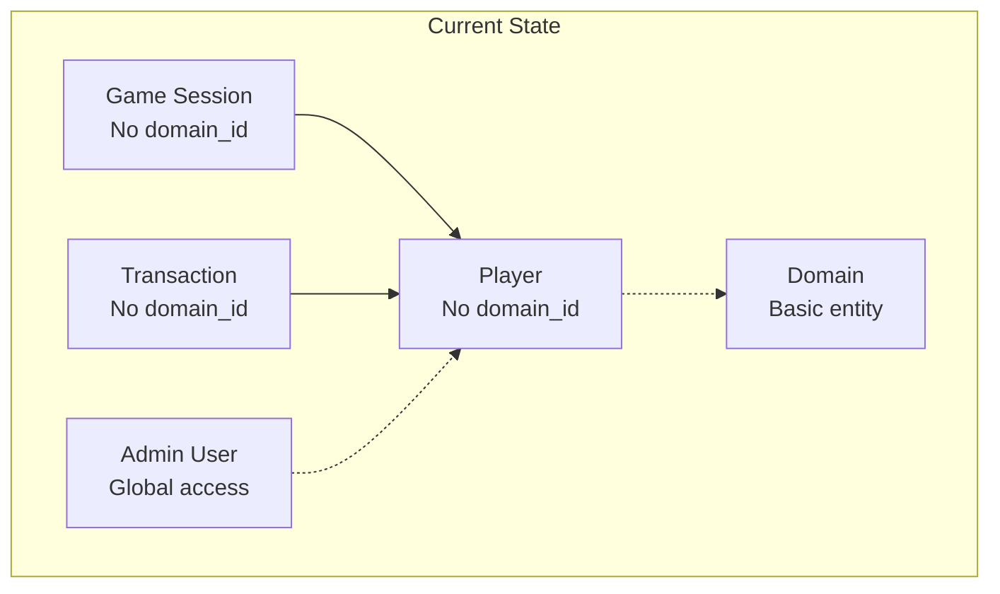
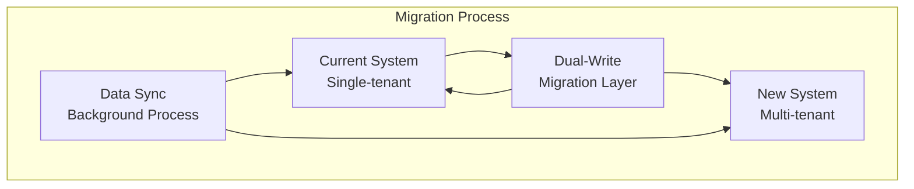

# UG Casino Multitenancy - Migration Strategy

**Document Version:** 1.0  
**Date:** July 2025  
**Status:** Complete  
**Author:** Technical Architecture Team  

## Migration Overview

This document outlines the comprehensive strategy for migrating the existing UG Casino platform to support multitenancy while maintaining zero downtime and data integrity.

### Migration Principles

1. **Zero Downtime** - No service interruption during migration
2. **Data Integrity** - 100% data consistency and no data loss
3. **Rollback Capability** - Ability to revert changes at any point
4. **Incremental Approach** - Gradual migration with validation at each step
5. **Backward Compatibility** - Existing functionality remains unchanged

## Current State Analysis

### Existing Data Distribution
- **Total Players:** ~500K records across all domains
- **Game Sessions:** ~50M records over 2 years
- **Transactions:** ~200M records with financial data
- **Admin Users:** ~50 admin accounts
- **Domains:** ~10 existing domains with basic support

### Data Relationships


### Migration Challenges
- **Large Data Volume** - 750M+ records to migrate
- **Complex Relationships** - Cross-table data consistency
- **Active System** - 24/7 operations during migration
- **Domain Assignment** - Determining correct domain for existing data

## Migration Strategy

### Approach: Blue-Green with Dual-Write Pattern

The migration uses a combination of blue-green deployment and dual-write pattern to ensure zero downtime and data consistency.



### Migration Phases

#### Phase 1: Infrastructure Preparation (Week 1-2)
**Objective:** Prepare the new multi-tenant infrastructure without affecting current operations

**Tasks:**
1. **Database Schema Updates**
   - Add new tables (tenant_property, tenant_feature_flag)
   - Add domain_id columns with NULL allowed
   - Create indexes for performance
   - Validate schema changes on staging

2. **Application Deployment**
   - Deploy new multi-tenant code with feature flags OFF
   - Maintain backward compatibility
   - Monitor application health

3. **Data Analysis**
   - Analyze existing data for domain assignment
   - Identify orphaned or inconsistent records
   - Create domain mapping rules

#### Phase 2: Domain Assignment & Data Migration (Week 3-4)
**Objective:** Assign domains to existing data and populate domain_id fields

**Tasks:**
1. **Domain Assignment Logic**
   ```java
   @Service
   @Transactional
   public class DataMigrationService {
       
       public void assignDomainsToExistingData() {
           // Strategy 1: Use mirrorUrl field
           assignPlayersByMirrorUrl();
           
           // Strategy 2: Use registration source
           assignPlayersByRegistrationSource();
           
           // Strategy 3: Use affiliate parameters
           assignPlayersByAffiliateData();
           
           // Strategy 4: Default domain for unassigned
           assignRemainingPlayersToDefault();
       }
       
       private void assignPlayersByMirrorUrl() {
           List<Player> playersWithMirror = playerRepository.findByMirrorUrlNotNull();
           
           for (Player player : playersWithMirror) {
               Domain domain = findDomainByUrl(player.getMirrorUrl());
               if (domain != null) {
                   player.setDomainId(domain.getId());
                   playerRepository.save(player);
               }
           }
       }
   }
   ```

2. **Batch Processing**
   - Process players in batches of 10,000
   - Update related records (sessions, transactions)
   - Validate data consistency after each batch

3. **Data Validation**
   - Verify all players have domain assignments
   - Check referential integrity
   - Validate business logic consistency

#### Phase 3: Dual-Write Implementation (Week 5-6)  
**Objective:** Implement dual-write pattern for new data while migrating existing data

**Tasks:**
1. **Dual-Write Middleware**
   ```java
   @Component
   public class DualWriteService {
       
       @EventListener
       public void handlePlayerCreation(PlayerCreatedEvent event) {
           // Write to both old and new patterns
           writeToLegacySystem(event.getPlayer());
           writeToMultiTenantSystem(event.getPlayer());
           
           // Validate consistency
           validateDataConsistency(event.getPlayer());
       }
   }
   ```

2. **Background Synchronization**
   - Sync existing data to new schema
   - Handle conflicts and inconsistencies
   - Monitor sync progress and errors

3. **Validation Framework**
   - Compare data between old and new systems
   - Alert on inconsistencies
   - Automatic reconciliation where possible

#### Phase 4: Feature Flag Activation (Week 7-8)
**Objective:** Gradually enable multi-tenant features with monitoring

**Tasks:**
1. **Progressive Rollout**
   ```yaml
   # Feature flag configuration
   multitenancy:
     tenant_resolution: true
     tenant_filtering: false  # Start with false
     admin_multitenancy: false
     
   rollout:
     percentage: 0  # Start with 0% traffic
     domains: ["test.casino.com"]  # Test domain only
   ```

2. **Monitoring & Validation**
   - Monitor application performance
   - Validate tenant isolation
   - Check for errors or inconsistencies

3. **Gradual Increase**
   - Increase rollout percentage: 0% → 10% → 50% → 100%
   - Add production domains progressively
   - Monitor at each step

#### Phase 5: Full Migration (Week 9-10)
**Objective:** Complete migration to multi-tenant system

**Tasks:**
1. **Final Data Migration**
   - Migrate remaining data
   - Remove legacy compatibility code
   - Clean up temporary migration tables

2. **Schema Cleanup**
   - Make domain_id columns NOT NULL
   - Add foreign key constraints
   - Remove deprecated fields

3. **Full Feature Activation**
   - Enable all multi-tenant features
   - Remove feature flags
   - Update monitoring and alerting

## Detailed Migration Procedures

### Database Migration Scripts

#### Script 1: Schema Preparation
```sql
-- 500_MIGRATION_schema_preparation.sql
-- Add domain_id columns (nullable initially)
ALTER TABLE player ADD COLUMN domain_id BIGINT;
ALTER TABLE external_game_session ADD COLUMN domain_id BIGINT;
ALTER TABLE integration_transaction ADD COLUMN domain_id BIGINT;

-- Create indexes for performance
CREATE INDEX CONCURRENTLY idx_player_domain_id ON player(domain_id);
CREATE INDEX CONCURRENTLY idx_game_session_domain_id ON external_game_session(domain_id);
CREATE INDEX CONCURRENTLY idx_transaction_domain_id ON integration_transaction(domain_id);

-- Create tenant configuration tables
CREATE TABLE tenant_property (
    id SERIAL PRIMARY KEY,
    domain_id BIGINT NOT NULL,
    property_name VARCHAR(128) NOT NULL,
    property_value TEXT,
    created_at TIMESTAMP DEFAULT CURRENT_TIMESTAMP,
    updated_at TIMESTAMP DEFAULT CURRENT_TIMESTAMP,
    UNIQUE(domain_id, property_name)
);

-- Add foreign keys (initially not enforced)
ALTER TABLE tenant_property ADD CONSTRAINT fk_tenant_property_domain 
    FOREIGN KEY (domain_id) REFERENCES domain(id) NOT VALID;
```

#### Script 2: Domain Assignment
```sql
-- 501_MIGRATION_domain_assignment.sql
-- Create default domain if it doesn't exist
INSERT INTO domain (url, tenant_code, display_name, status, created_at)
VALUES ('default.casino.com', 'default', 'Default Casino', 'ACTIVE', CURRENT_TIMESTAMP)
ON CONFLICT (tenant_code) DO NOTHING;

-- Assign players by mirror URL
UPDATE player 
SET domain_id = d.id
FROM domain d
WHERE player.mirror_url LIKE '%' || d.url || '%'
AND player.domain_id IS NULL;

-- Assign remaining players to default domain
UPDATE player 
SET domain_id = (SELECT id FROM domain WHERE tenant_code = 'default')
WHERE domain_id IS NULL;

-- Update related records
UPDATE external_game_session 
SET domain_id = p.domain_id
FROM player p
WHERE external_game_session.player_id = p.id
AND external_game_session.domain_id IS NULL;

UPDATE integration_transaction 
SET domain_id = p.domain_id
FROM player p
WHERE integration_transaction.player_id = p.id
AND integration_transaction.domain_id IS NULL;
```

#### Script 3: Constraints and Validation
```sql
-- 502_MIGRATION_constraints.sql
-- Validate all records have domain assignments
DO $$
BEGIN
    IF EXISTS (SELECT 1 FROM player WHERE domain_id IS NULL) THEN
        RAISE EXCEPTION 'Players without domain assignment found';
    END IF;
    
    IF EXISTS (SELECT 1 FROM external_game_session WHERE domain_id IS NULL) THEN
        RAISE EXCEPTION 'Game sessions without domain assignment found';
    END IF;
END $$;

-- Make domain_id NOT NULL
ALTER TABLE player ALTER COLUMN domain_id SET NOT NULL;
ALTER TABLE external_game_session ALTER COLUMN domain_id SET NOT NULL;
ALTER TABLE integration_transaction ALTER COLUMN domain_id SET NOT NULL;

-- Add foreign key constraints
ALTER TABLE player ADD CONSTRAINT fk_player_domain 
    FOREIGN KEY (domain_id) REFERENCES domain(id);
ALTER TABLE external_game_session ADD CONSTRAINT fk_game_session_domain 
    FOREIGN KEY (domain_id) REFERENCES domain(id);
ALTER TABLE integration_transaction ADD CONSTRAINT fk_transaction_domain 
    FOREIGN KEY (domain_id) REFERENCES domain(id);
```

### Application Migration Code

#### Migration Service Implementation
```java
@Service
@Slf4j
public class MultiTenantMigrationService {
    
    private final PlayerRepository playerRepository;
    private final DomainService domainService;
    private final MigrationAuditService auditService;
    
    @Transactional
    public MigrationResult migratePlayersToTenants() {
        log.info("Starting player migration to multi-tenant structure");
        
        MigrationResult result = new MigrationResult();
        
        try {
            // Phase 1: Assign domains by mirror URL
            int mirrorAssigned = assignPlayersByMirrorUrl();
            result.addSuccess("mirror_url_assignment", mirrorAssigned);
            
            // Phase 2: Assign by registration source
            int sourceAssigned = assignPlayersByRegistrationSource();
            result.addSuccess("source_assignment", sourceAssigned);
            
            // Phase 3: Assign by affiliate parameters
            int affiliateAssigned = assignPlayersByAffiliateParams();
            result.addSuccess("affiliate_assignment", affiliateAssigned);
            
            // Phase 4: Default assignment for remaining
            int defaultAssigned = assignRemainingPlayersToDefault();
            result.addSuccess("default_assignment", defaultAssigned);
            
            // Validation
            validateMigrationCompleteness();
            
            log.info("Player migration completed successfully: {}", result);
            return result;
            
        } catch (Exception e) {
            log.error("Player migration failed", e);
            result.addError("migration_failed", e.getMessage());
            throw new MigrationException("Migration failed", e);
        }
    }
    
    private int assignPlayersByMirrorUrl() {
        List<Player> playersWithMirror = playerRepository.findByMirrorUrlNotNullAndDomainIdNull();
        int assigned = 0;
        
        for (Player player : playersWithMirror) {
            try {
                Domain domain = findDomainByMirrorUrl(player.getMirrorUrl());
                if (domain != null) {
                    player.setDomainId(domain.getId());
                    playerRepository.save(player);
                    assigned++;
                    
                    auditService.logPlayerDomainAssignment(
                        player.getId(), domain.getId(), "mirror_url"
                    );
                }
            } catch (Exception e) {
                log.warn("Failed to assign domain for player {} by mirror URL: {}", 
                    player.getId(), e.getMessage());
            }
        }
        
        log.info("Assigned {} players by mirror URL", assigned);
        return assigned;
    }
    
    private Domain findDomainByMirrorUrl(String mirrorUrl) {
        if (mirrorUrl == null) return null;
        
        // Extract hostname from mirror URL
        String hostname = extractHostname(mirrorUrl);
        
        // Find matching domain
        return domainService.findByUrl(hostname).orElse(null);
    }
    
    private void validateMigrationCompleteness() {
        long playersWithoutDomain = playerRepository.countByDomainIdNull();
        if (playersWithoutDomain > 0) {
            throw new MigrationException(
                String.format("Migration incomplete: %d players without domain assignment", 
                    playersWithoutDomain)
            );
        }
        
        long sessionsWithoutDomain = gameSessionRepository.countByDomainIdNull();
        if (sessionsWithoutDomain > 0) {
            throw new MigrationException(
                String.format("Migration incomplete: %d sessions without domain assignment", 
                    sessionsWithoutDomain)
            );
        }
    }
}

@Data
public class MigrationResult {
    private Map<String, Integer> successCounts = new HashMap<>();
    private Map<String, String> errors = new HashMap<>();
    private LocalDateTime startTime = LocalDateTime.now();
    private LocalDateTime endTime;
    
    public void addSuccess(String operation, int count) {
        successCounts.put(operation, count);
    }
    
    public void addError(String operation, String error) {
        errors.put(operation, error);
    }
    
    public int getTotalSuccess() {
        return successCounts.values().stream().mapToInt(Integer::intValue).sum();
    }
    
    public boolean hasErrors() {
        return !errors.isEmpty();
    }
}
```

### Data Validation and Consistency

#### Validation Framework
```java
@Service
public class MigrationValidationService {
    
    public ValidationReport validateTenantDataConsistency() {
        ValidationReport report = new ValidationReport();
        
        // Validate player-domain assignments
        validatePlayerDomainAssignments(report);
        
        // Validate referential integrity
        validateReferentialIntegrity(report);
        
        // Validate business rules
        validateBusinessRules(report);
        
        // Validate data counts
        validateDataCounts(report);
        
        return report;
    }
    
    private void validatePlayerDomainAssignments(ValidationReport report) {
        // Check for players without domain
        long playersWithoutDomain = playerRepository.countByDomainIdNull();
        if (playersWithoutDomain > 0) {
            report.addError("players_without_domain", 
                String.format("%d players have no domain assignment", playersWithoutDomain));
        }
        
        // Check for invalid domain references
        List<Player> playersWithInvalidDomain = playerRepository.findPlayersWithInvalidDomain();
        if (!playersWithInvalidDomain.isEmpty()) {
            report.addError("invalid_domain_references", 
                String.format("%d players reference non-existent domains", 
                    playersWithInvalidDomain.size()));
        }
    }
    
    private void validateReferentialIntegrity(ValidationReport report) {
        // Validate game sessions reference same domain as player
        long inconsistentSessions = gameSessionRepository.countInconsistentTenantAssignments();
        if (inconsistentSessions > 0) {
            report.addError("inconsistent_session_domains", 
                String.format("%d game sessions have different domain than their player", 
                    inconsistentSessions));
        }
        
        // Validate transactions reference same domain as player
        long inconsistentTransactions = transactionRepository.countInconsistentTenantAssignments();
        if (inconsistentTransactions > 0) {
            report.addError("inconsistent_transaction_domains", 
                String.format("%d transactions have different domain than their player", 
                    inconsistentTransactions));
        }
    }
}

@Data
public class ValidationReport {
    private List<ValidationError> errors = new ArrayList<>();
    private List<ValidationWarning> warnings = new ArrayList<>();
    private Map<String, Long> statistics = new HashMap<>();
    private LocalDateTime validationTime = LocalDateTime.now();
    
    public void addError(String code, String message) {
        errors.add(new ValidationError(code, message));
    }
    
    public void addWarning(String code, String message) {
        warnings.add(new ValidationWarning(code, message));
    }
    
    public boolean hasErrors() {
        return !errors.isEmpty();
    }
    
    public boolean isValid() {
        return errors.isEmpty();
    }
}
```

## Rollback Strategy

### Rollback Triggers
- **Data Inconsistency** - Cross-tenant data access detected
- **Performance Degradation** - >100ms latency increase
- **Critical Errors** - System instability or data corruption
- **Business Impact** - Customer-facing issues

### Rollback Procedures

#### Emergency Rollback (< 1 hour)
```java
@Service
public class EmergencyRollbackService {
    
    @Transactional
    public void executeEmergencyRollback() {
        log.warn("Executing emergency rollback to single-tenant mode");
        
        try {
            // 1. Disable multi-tenant features
            disableMultiTenantFeatures();
            
            // 2. Switch traffic to blue environment
            switchTrafficToBlueEnvironment();
            
            // 3. Validate system stability
            validateSystemStability();
            
            log.info("Emergency rollback completed successfully");
            
        } catch (Exception e) {
            log.error("Emergency rollback failed", e);
            throw new RollbackException("Emergency rollback failed", e);
        }
    }
    
    private void disableMultiTenantFeatures() {
        // Disable feature flags
        featureFlagService.disableFlag("MULTITENANCY_ENABLED");
        featureFlagService.disableFlag("TENANT_ISOLATION");
        featureFlagService.disableFlag("TENANT_ADMIN");
        
        // Clear tenant context cache
        tenantCacheService.clearAll();
        
        // Reset to legacy behavior
        configurationService.enableLegacyMode();
    }
}
```

#### Complete Rollback (4-8 hours)
```sql
-- Rollback script for complete reversion
-- 900_ROLLBACK_complete.sql

-- Remove foreign key constraints
ALTER TABLE player DROP CONSTRAINT IF EXISTS fk_player_domain;
ALTER TABLE external_game_session DROP CONSTRAINT IF EXISTS fk_game_session_domain;
ALTER TABLE integration_transaction DROP CONSTRAINT IF EXISTS fk_transaction_domain;

-- Make domain_id nullable again
ALTER TABLE player ALTER COLUMN domain_id DROP NOT NULL;
ALTER TABLE external_game_session ALTER COLUMN domain_id DROP NOT NULL;
ALTER TABLE integration_transaction ALTER COLUMN domain_id DROP NOT NULL;

-- Option 1: Keep domain_id columns (recommended)
-- SET domain_id to NULL to disable tenant filtering
UPDATE player SET domain_id = NULL;
UPDATE external_game_session SET domain_id = NULL;
UPDATE integration_transaction SET domain_id = NULL;

-- Option 2: Drop domain_id columns (if necessary)
-- ALTER TABLE player DROP COLUMN domain_id;
-- ALTER TABLE external_game_session DROP COLUMN domain_id;
-- ALTER TABLE integration_transaction DROP COLUMN domain_id;

-- Drop tenant-specific tables
DROP TABLE IF EXISTS tenant_property;
DROP TABLE IF EXISTS tenant_feature_flag;
DROP TABLE IF EXISTS admin.user_domain_access;
DROP TABLE IF EXISTS admin.user_domain_role;
```

## Testing Strategy

### Pre-Migration Testing

#### Data Analysis Testing
```java
@Test
public void testDomainAssignmentLogic() {
    // Test mirror URL assignment
    Player player = createTestPlayer("test@casino.com", "test.casino.com");
    Domain expectedDomain = createTestDomain("test.casino.com");
    
    migrationService.assignPlayersByMirrorUrl();
    
    Player updatedPlayer = playerRepository.findById(player.getId()).get();
    assertEquals(expectedDomain.getId(), updatedPlayer.getDomainId());
}

@Test
public void testDataConsistencyValidation() {
    // Create test data with inconsistencies
    Player player = createTestPlayer("test@casino.com", domain1.getId());
    GameSession session = createTestGameSession(player.getId(), domain2.getId());
    
    ValidationReport report = validationService.validateTenantDataConsistency();
    
    assertTrue(report.hasErrors());
    assertTrue(report.getErrors().stream()
        .anyMatch(error -> error.getCode().equals("inconsistent_session_domains")));
}
```

#### Migration Testing
```java
@Test
@Transactional
@Rollback
public void testCompleteMigrationProcess() {
    // Setup test data
    createTestPlayersWithVariousStates();
    
    // Execute migration
    MigrationResult result = migrationService.migratePlayersToTenants();
    
    // Validate results
    assertFalse(result.hasErrors());
    assertEquals(0, playerRepository.countByDomainIdNull());
    
    // Validate data consistency
    ValidationReport validation = validationService.validateTenantDataConsistency();
    assertTrue(validation.isValid());
}
```

### Post-Migration Testing

#### Tenant Isolation Testing  
```java
@Test
public void testTenantDataIsolation() {
    // Set tenant context for domain1
    TenantContext.setTenant(createTenantInfo(domain1));
    
    // Create player in domain1
    Player player1 = playerService.createPlayer(createPlayerRequest("test1@casino.com"));
    
    // Switch to domain2 context
    TenantContext.setTenant(createTenantInfo(domain2));
    
    // Verify player1 is not accessible from domain2
    assertThrows(PlayerNotFoundException.class, 
        () -> playerService.getPlayerById(player1.getId()));
}
```

## Monitoring and Alerting

### Migration Monitoring

#### Key Metrics
- **Migration Progress** - Records migrated per hour
- **Data Consistency** - Validation check results
- **System Performance** - Response times during migration
- **Error Rates** - Failed operations per minute

#### Alerts
```yaml
# Migration monitoring alerts
alerts:
  - name: migration_progress_slow
    condition: migration_rate < 10000_records_per_hour
    severity: warning
    
  - name: data_inconsistency_detected
    condition: validation_errors > 0
    severity: critical
    
  - name: migration_performance_impact
    condition: response_time_increase > 50ms
    severity: warning
    
  - name: migration_errors_high
    condition: error_rate > 1_percent
    severity: critical
```

### Post-Migration Monitoring

#### Tenant Isolation Monitoring
```java
@Component
public class TenantIsolationMonitor {
    
    @EventListener
    public void handleDataAccess(DataAccessEvent event) {
        TenantInfo currentTenant = TenantContext.getCurrentTenantOptional().orElse(null);
        
        if (currentTenant == null) {
            alertService.sendAlert("data_access_without_tenant_context", event);
            return;
        }
        
        // Check if accessed data belongs to current tenant
        if (event.getDataTenantId() != null && 
            !currentTenant.getDomainId().equals(event.getDataTenantId())) {
            
            alertService.sendCriticalAlert("cross_tenant_data_access_attempt", 
                Map.of(
                    "currentTenant", currentTenant.getTenantCode(),
                    "accessedTenant", event.getDataTenantId(),
                    "user", event.getUserId(),
                    "operation", event.getOperation()
                )
            );
        }
    }
}
```

## Success Criteria

### Migration Success Metrics

#### Data Integrity
- [ ] 100% of players assigned to domains
- [ ] 100% of game sessions linked to correct tenant
- [ ] 100% of transactions linked to correct tenant
- [ ] Zero data loss during migration
- [ ] All referential integrity constraints satisfied

#### Performance
- [ ] <50ms latency increase during migration
- [ ] <100ms tenant resolution time
- [ ] >95% cache hit rate for tenant data
- [ ] Zero downtime during migration

#### Security
- [ ] 100% tenant isolation validated
- [ ] Zero cross-tenant data access incidents
- [ ] All security tests passing
- [ ] Comprehensive audit trail implemented

### Post-Migration Validation

#### Functional Validation
- [ ] All existing functionality working
- [ ] New multi-tenant features operational
- [ ] Admin interface for tenant management
- [ ] Automated tenant provisioning working

#### Business Validation
- [ ] New casino deployment in <24 hours
- [ ] Configuration changes in <1 hour
- [ ] Support ticket reduction >50%
- [ ] Customer satisfaction maintained

## Conclusion

This migration strategy provides a comprehensive, low-risk approach to implementing multitenancy in the UG Casino platform. Key strengths of the approach:

1. **Zero Downtime** - Blue-green deployment with dual-write pattern
2. **Data Safety** - Comprehensive validation and rollback procedures
3. **Incremental Risk** - Phased approach with validation at each step
4. **Business Continuity** - Existing operations remain unaffected

### Critical Success Factors

1. **Thorough Testing** - Comprehensive testing on staging with production data
2. **Monitoring** - Real-time monitoring of all migration phases
3. **Team Readiness** - 24/7 support team during migration period
4. **Communication** - Clear communication with all stakeholders
5. **Rollback Preparedness** - Tested rollback procedures ready at all times

The successful execution of this migration strategy will enable the UG Casino platform to support unlimited casino brands while maintaining the highest standards of data integrity, security, and performance.

---

**Migration Status:** Strategy Complete, Ready for Implementation  
**Risk Level:** Low with proper execution  
**Estimated Duration:** 10 weeks  
**Rollback Capability:** <1 hour emergency, <8 hours complete  
**Data Safety:** 100% with comprehensive validation